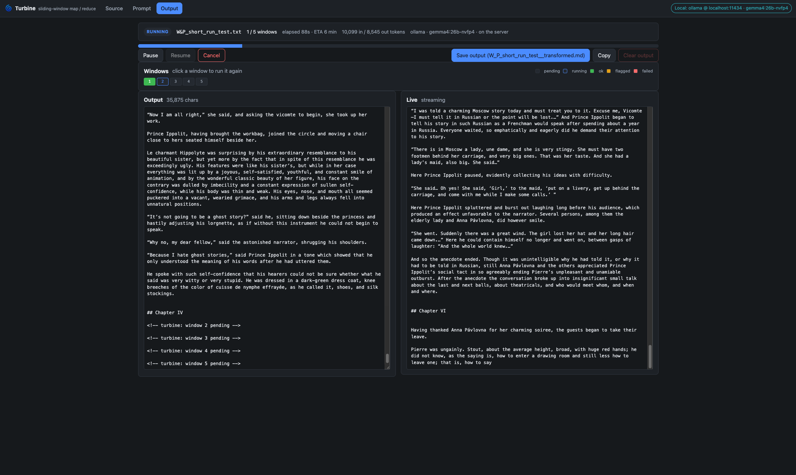
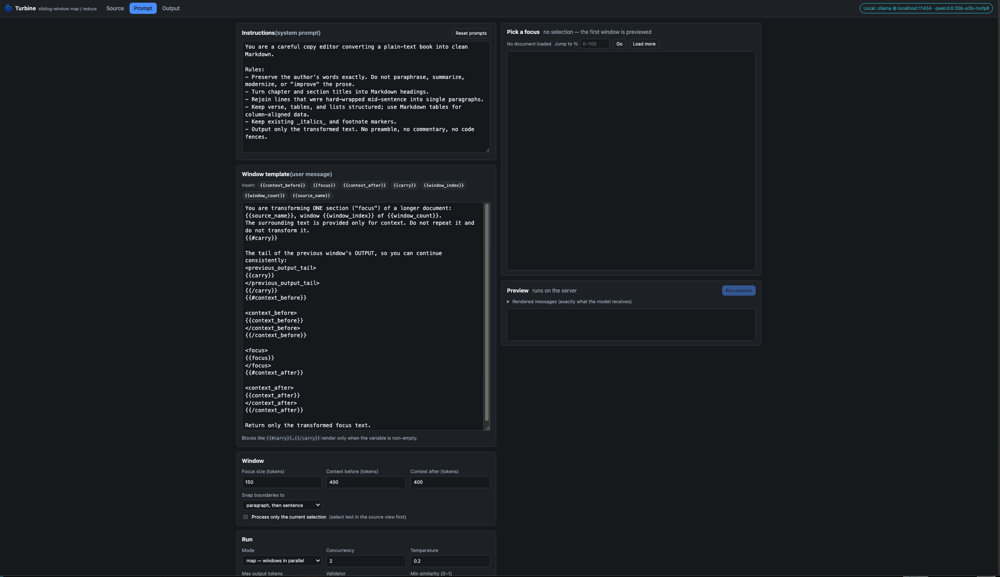
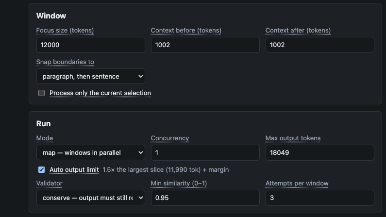
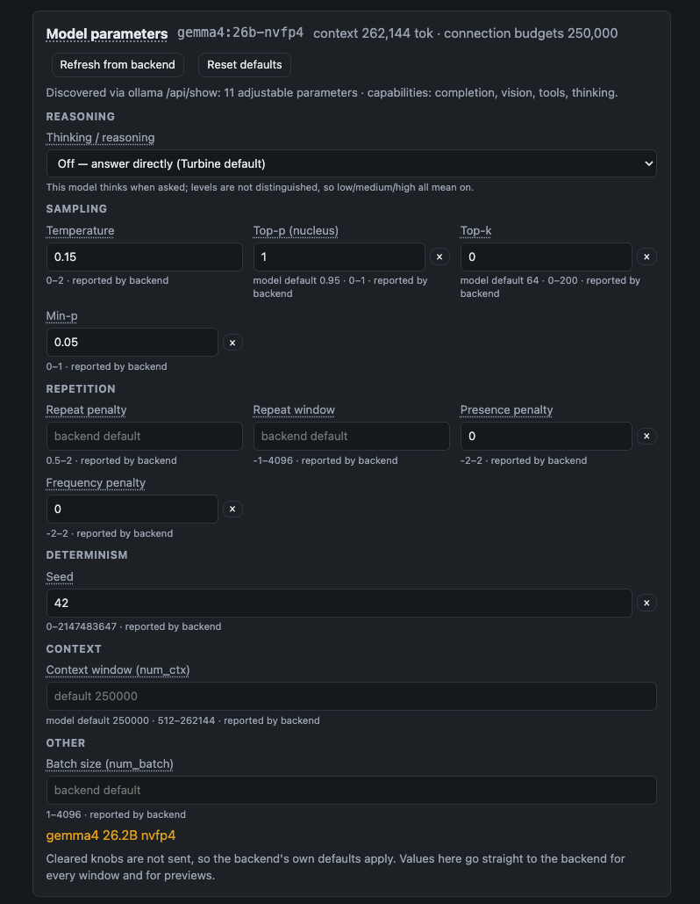

<p align="center">
  
</p>

# Turbine

A programmable sliding-window **map/reduce pump for long documents**. Turbine reads a source text, tiles it into windows, applies your prompt to each window (in parallel, or sequentially with carry-forward), validates the result, checkpoints every window, and concatenates the outputs into `<source>__transformed.md`.

It is a browser-hosted app: [DiamondJS](https://github.com/Node0/diamondjs) front end, [Elysia](https://elysiajs.com) on [Bun](https://bun.sh) back end. Run it on your Mac, on a LAN box, or on a public server. Inference comes from wherever you point it: Ollama, vLLM, llama.cpp, OpenRouter, OpenAI, Anthropic, or any OpenAI-compatible endpoint.

Turbine was built to turn plain-text books into clean Markdown without changing a single word of the author's prose, and the **conserve** validator exists to prove that it didn't. But the instructions are arbitrary: style rewrites, translation, annotation, extraction, anything that fits in a window.

<p align="center">
  
  <br>
  <sub>Reformatting <em>War and Peace</em> with a local 26B model. Finished windows land in the assembled output on the left; the window in flight streams on the right.</sub>
</p>

---

## Contents

- [How it works](#how-it-works)
- [Quick start](#quick-start)
- [First visit: connecting a backend](#first-visit-connecting-a-backend)
- [Prompts and templates](#prompts-and-templates)
- [Windows](#windows)
- [Model parameters](#model-parameters)
- [Validators](#validators)
- [Running a job](#running-a-job)
- [Where do the API keys go?](#where-do-the-api-keys-go)
- [Where does inference run?](#where-does-inference-run)
- [config.json](#configjson)
- [Repository layout](#repository-layout)
- [Sample documents and the corpus tool](#sample-documents-and-the-corpus-tool)
- [Development](#development)
- [License](#license)

---

## How it works

```
source text ──► planner ──► [ctx_before | FOCUS | ctx_after] × N windows
                                   │
                    prompt template + your instructions
                                   │
                              provider.generate()  (streamed)
                                   │
                              validator (none | conserve | length-ratio)
                                   │  retry at lower temperature, then flag
                              checkpoint  <stem>__turbine.jsonl
                                   │
                    assemble in index order ──► <stem>__transformed.md
```

- **Focus regions tile the document with no overlap.** Only the focus is transformed and emitted, so outputs concatenate cleanly. The context on either side is read-only and may overlap.
- Focus boundaries snap to a **paragraph break**, then a **sentence end**, then whitespace, then a hard cut.
- **map** runs windows in parallel with a concurrency limit; results land by index.
- **fold** runs windows in order and can carry the tail of the previous *output* into the next prompt. This is the actual "reduce".
- Every finished window is one JSON line in the checkpoint file, with the model, connection, prompt hash, timing, token usage and validation result. Jobs resume from it; single windows can be re-run.
- Nothing is ever silently truncated. If a planned prompt plus its output budget would not fit the model's context, the plan says so and the job cannot start.

---

## Quick start

Requirements: [Bun](https://bun.sh) ≥ 1.2 and Node ≥ 20 (Parcel, which builds the DiamondJS client, runs under Node).

```bash
git clone https://github.com/Node0/turbine.git
cd turbine
bun install
bun run build          # compiles the client into dist/client
bun run start          # http://localhost:7331
```

Development, with the client rebuilding on save and the server restarting on change:

```bash
bun run dev
```

If you have [Ollama](https://ollama.com) running on the default port, the first page will offer it as a local backend and you can be transforming text within a minute. Drop a `.txt` or `.md` file on the **Source** tab, write or keep the default instructions on the **Prompt** tab, and press *Start job*.

---

## First visit: connecting a backend

The app looks for its own saved connection in this browser. If there is none, it asks you to choose:

- **Local inference backend**: Ollama, vLLM or llama.cpp. You give host, port, path and model. No passphrase, because there is no secret to protect.
- **Remote inference provider**: OpenRouter, OpenAI, Anthropic or a custom OpenAI-compatible endpoint, plus your API key and a **short passphrase**. The passphrase derives a key (PBKDF2, 310k iterations, random per-browser salt) that encrypts your API key in this browser's local storage with AES-GCM. On later visits you type the passphrase to unlock.

A browser fingerprint hash is recorded alongside the vault. It never decides anything on its own; if it changes (browser update, new machine) you are simply asked for the passphrase again.

The header shows where inference is running at all times ("OpenRouter · model" or "Local: ollama @ host:port"), and a small countdown shows when the server will forget your key.

---

## Prompts and templates

<p align="center">
  
  <br>
  <sub>The Prompt tab. Instructions become the system message; the window template becomes the user message for every window.</sub>
</p>

Two text boxes define what the model sees:

- **Instructions** are the system prompt. The default is a careful copy editor converting plain text to Markdown without paraphrasing.
- **Window template** is the user message, rendered once per window. Variables: `{{context_before}}`, `{{focus}}`, `{{context_after}}`, `{{carry}}`, `{{window_index}}`, `{{window_count}}`, `{{source_name}}`. Conditionals keep one template working for both map and fold modes:

  ```
   …  …  … 
  ```

  `` renders when the variable is non-empty (not `''`, `0` or missing) and `` when it is empty. `` repeats the variable it closes, so a mismatched block is a clear error, not a silently wrong prompt. A tag alone on its line removes the whole line. Values are inserted as plain text and never parsed again, so a document containing `{{ … }}` or `` passes through untouched. A `{%` that isn't a valid tag is an error with a line and column; the editor shows it and Preview and Start stay disabled until it's fixed. Templates saved in the older `{{#name}}…{{/name}}` style are converted when loaded.

**Pick a focus** lets you choose any window from the plan (or jump to a percentage of the document) and **Run preview** sends exactly that window to the backend. The *Rendered messages* disclosure shows the literal system and user messages the model received, so there is no guessing about what the template expanded to.

Hover help for every field lives in `client/tooltips.json`, keyed `view → component → field`, so wording can be revised without touching templates.

---

## Windows

<p align="center">
  
  <br>
  <sub>Window geometry and run settings. Everything the model measures is in tokens, so the UI leads with tokens.</sub>
</p>

### Tokens, not characters

Three sources feed the token numbers; the best available one wins:

1. **The model itself.** After every preview the backend's `usage` figures (prompt and completion tokens) are shown next to the output and used to recalibrate the plan's chars-per-token for *that* model.
2. **tiktoken (Rust → WASM, `cl100k_base`).** Loaded lazily in the browser from `/vendor/tiktoken/` (about 2 MB, cached). Selections, the preview focus, and the generated-token counter are counted exactly with it. Not any local model's exact vocabulary, but within a few percent on English prose.
3. **4 characters per token.** The fallback until either of the above is available.

**Max output tokens** is the per-window generation ceiling sent to the backend (`max_tokens` / `num_predict`). It is not derived from the whole corpus: each window is its own request. With **Auto output limit** on (the default) it is set to 1.5× the largest slice plus a margin, capped by what the model's context leaves after the largest prompt. Set it by hand and the plan warns if it falls below the largest slice, because that window's output would be cut off.

**Process only the current selection** restricts the plan to text you highlighted on the Source tab, which is the quick way to test instructions on one awkward chapter before committing to the whole book.

### The context window and the sliding window

Two different things share the word "window":

- **The model's context window** is how many tokens the backend can hold at once, prompt and answer together. You set it on the Connect page as *Context length*; it becomes the connection's `ctx_len`.
- **Turbine's sliding windows** are the slices the planner cuts the document into: focus plus context on either side.

They meet in the plan. Every planned prompt (instructions + template + context before + focus + context after + carry) must fit inside `ctx_len` together with the output limit, or the plan shows an error and *Start job* is disabled.

What the backend does with `ctx_len` depends on the dialect:

| Backend | What `ctx_len` does at runtime |
|---|---|
| **Ollama** | Sent as `options.num_ctx` on every request, so the runtime KV cache matches the plan. Set 65,536 on the Connect page and the model is loaded with a 64k context, no more, no less. Override it per job with the `num_ctx` knob in Model parameters. Changing it makes Ollama reload the model; memory scales with it. |
| **vLLM / llama.cpp** | The context is fixed when the server starts (`--max-model-len`, `-c`). Turbine reads it back (`max_model_len`, `/props`) and warns when your `ctx_len` is larger than the server allows. |
| **OpenRouter / OpenAI / Anthropic** | The model's context is fixed by the provider. Turbine reads it from the model list and shows it next to your `ctx_len`; keep `ctx_len` at or below it. |

A smaller `ctx_len` therefore means smaller windows (or fewer of them fitting), a smaller *Auto* output limit, and, on Ollama, a smaller memory footprint.

---

## Model parameters

<p align="center">
  
  <br>
  <sub>Discovered, not hard-coded. Every knob shows its bounds, the model's own default, and where that information came from.</sub>
</p>

The *Model parameters* panel on the Prompt tab is populated by asking the backend, not from a fixed list:

| Backend | Discovery endpoint | What it yields |
|---|---|---|
| Ollama | `POST /api/show` | capabilities (`thinking`, `vision`, `tools`), modelfile defaults (`temperature`, `top_p`, `top_k`, `min_p`, penalties), the architecture's context length |
| OpenRouter | `GET /api/v1/models` | per-model `supported_parameters`, `context_length`, `max_completion_tokens`, `default_parameters`, and a `reasoning` descriptor (mandatory? supported efforts?) |
| OpenAI | model id rules + `/v1/models` | reasoning models (o-series, GPT-5) take `reasoning_effort` and `max_completion_tokens` and reject sampling knobs |
| vLLM | `GET /v1/models` | `max_model_len` |
| llama.cpp | `GET /props` | `n_ctx` and the server's default sampling settings |
| Anthropic | `GET /v1/models/{id}` + generation rules | context and output caps; which generations accept `thinking: disabled`, `between_tools`, or always think |

Reasoning is one normalized control (**off**, **on**, **low**, **medium**, **high**) that each provider translates: Ollama `think`, OpenRouter `reasoning.effort` / `reasoning.enabled:false`, OpenAI `reasoning_effort`, vLLM and llama.cpp `chat_template_kwargs.enable_thinking`, Anthropic `thinking` + `output_config.effort`. **Off is the default for every backend**, so reasoning models spend their tokens on the transformation rather than deliberation. Where a model always reasons the panel says so and offers the lowest effort instead.

Every other knob is a descriptor with bounds and plain-language help. A cleared knob is not sent, so the backend's own default applies. *Reset defaults* clears them all, sets reasoning off and temperature back to the config default. *Refresh from backend* re-runs discovery, which matters after you pull a new model tag.

---

## Validators

Each window's output can be checked before it is accepted. A failed check retries at a lower temperature up to *Attempts per window* times, then the window is **flagged**: its last output is kept but marked, never silently accepted. A window whose every attempt produced nothing is marked **failed** instead.

| Validator | What it checks | Use it when |
|---|---|---|
| **none** | nothing | you trust the model, or the task is a free rewrite |
| **conserve** | the words of the output, with Markdown stripped, still match the words of the input | the model must *format*, not *rewrite*: Markdown conversion, heading promotion, paragraph rejoining |
| **length-ratio** | the output's length is within a configurable band of the input's | translation, light editing, anything where drift in size signals a problem |

**Min similarity** (the conserve validator) strips Markdown from the output, normalises case, quotes, dashes and punctuation on both sides, splits into words, and scores `2·LCS / (|input| + |output|)` where LCS is the longest common subsequence of words. 1.0 means every word survived in order; 0.95 tolerates roughly one word in twenty added, dropped or changed.

---

## Running a job

The **Output** tab is the job's cockpit:

- The **job strip** shows state, source name, windows done, elapsed time and ETA, cumulative input and output tokens, and which backend is doing the work and where (on the server or in this browser).
- **Window chips** show every window's state: pending, running, ok, flagged, failed. Click any chip to re-run just that window; the result replaces the old one in the checkpoint and the assembled output.
- **Output** is the assembled document so far. Windows that have not finished appear as `<!-- turbine: window N pending -->` placeholders, so the shape of the final file is visible from the first minute.
- **Live** streams the window currently being generated. It follows the newest text while you are at the bottom, releases when you scroll up, and re-engages when you scroll back down.
- **Pause**, **Resume** and **Cancel** do what they say. A paused or interrupted job resumes from its checkpoint; finished windows are never regenerated.
- **Save output** downloads `<stem>__transformed.md`. The checkpoint, `<stem>__turbine.jsonl`, carries full provenance for every window: model, connection, prompt hash, timing, token usage and validation result.

---

## Where do the API keys go?

| | Browser | Server memory | Server disk |
|---|---|---|---|
| Public deployment | AES-GCM in local storage, unlocked by your passphrase | Encrypted per session (HKDF from a boot-time master secret → AES-256-GCM), decrypted only for the duration of a request, **dropped when the session TTL elapses** | never |
| Private deployment | same | same | only if *you* put `api_key` or `api_key_env` on a connection in `config.json` |

`session.ttl_seconds` in `config.json` sets the countdown. With `extend_on_activity: true` the TTL slides on each request; the default is a fixed window. If the key expires mid-job, the job pauses in a `key-expired` state; unlock again and it resumes.

Error handlers scrub the key from any message they log. Authorization headers are never logged.

One caveat: browsers only expose WebCrypto on secure origins (https or localhost). If you open Turbine over plain http from another LAN machine, the browser cannot encrypt the key, so it remembers the connection but asks for the key again on each visit. Use https, a `.localhost` name, or put the key on a server connection in `config.json` for a private deployment.

---

## Where does inference run?

| `public_deployment` | Connection locality | Job runs in |
|---|---|---|
| `false` (your LAN) | any | the server |
| `true` | remote (OpenRouter, …) | the server, restricted to `remote_host_allowlist` |
| `true` | local (Ollama on the user's machine) | **the browser**, calling the user's own backend directly |

A public server never fetches a user-supplied URL, which closes the server-side request forgery hole; and "local" means *the user's* machine, which a public server could not reach anyway. Browser-run jobs need the tab open, and Ollama needs `OLLAMA_ORIGINS` set to the app's origin. Chrome may ask for local-network permission.

---

## config.json

```jsonc
{
  "public_deployment": false,
  "server":   { "host": "0.0.0.0", "port": 7331, "static_dir": "dist/client", "data_dir": "data", "trust_proxy": false },
  "session":  { "ttl_seconds": 3600, "extend_on_activity": false, "cookie_name": "turbine_sid" },
  "limits":   { "max_upload_bytes": 26214400, "max_concurrency": 8, "max_jobs_per_session": 4 },
  "window_defaults": { "focus_tokens": 1500, "context_before_tokens": 400, "context_after_tokens": 400,
                       "snap": "paragraph", "mode": "map", "concurrency": 2,
                       "carry": { "kind": "tail", "chars": 1200 }, "temperature": 0.2, "max_tokens": 2048,
                       "validator": { "kind": "none" }, "joiner": "\n\n" },
  "remote_host_allowlist": ["openrouter.ai", "api.openai.com", "api.anthropic.com"],
  "inference_service_connections": {
    "ollama-local": { "api_type": "ollama", "base_url": "http://localhost:11434",
                      "default_model": "qwen3.6:35b-a3b-mxfp8", "default_ctx_len": 32768,
                      "options": { "num_ctx": 32768 } },
    "openrouter":   { "api_type": "openai", "base_url": "https://openrouter.ai/api/v1",
                      "default_model": "qwen/qwen3-235b-a22b", "api_key_env": "OPENROUTER_API_KEY" }
  }
}
```

Each entry in `inference_service_connections` has a name, an `api_type` (`openai` | `ollama` | `anthropic`), a `base_url`, `default_*` fields and a free-form `options` passthrough. vLLM, llama.cpp and OpenRouter are all `openai`. Connections defined here appear as ready-made choices on the Connect page.

Environment variables:

| Variable | Purpose |
|---|---|
| `TURBINE_CONFIG` | path to a different config file |
| `TURBINE_MASTER_SECRET` | hex, ≥ 32 bytes; the key-vault master secret. If unset, a random secret is generated at boot, which is the intended default |
| `OPENROUTER_API_KEY` (or whatever `api_key_env` names) | server-side key for a private deployment |

`app/config/config.json` is separate and belongs to DiamondJS: `run_mode` `"dev"` prints the route table and keeps dev diagnostics; `"prod"` dead-code-eliminates them. Flip it and rebuild.

---

## Repository layout

```
turbine/
├── config.json              server + defaults (see above)
├── app/config/config.json   DiamondJS run_mode
├── shared/                  runs in the browser AND on the server
│   ├── types.ts             ConnectionSpec, JobSpec, WindowEvent, WindowRecord …
│   ├── api.ts               the HTTP/WS contract, every route in one comment block
│   ├── defaults.ts          defaultJobSpec / validateJobSpec
│   ├── providers/           registry keyed by api_type; openai / ollama / anthropic; presets; parameter discovery
│   └── engine/              planner, template, validators, runner (async generator), assemble
├── server/                  Elysia: sessions, key vault, docs, jobs, WS fan-out, static
├── client/                  DiamondJS: shell, routes, guards, services, pages, source viewer
│   └── tooltips.json        hover help, view → component → field
├── tools/fetch_corpus.ts    downloads and normalises a public-domain test corpus (see below)
├── sample_documents/        plain-text books to try Turbine on
├── tests/                   bun test: shared/, server/, live/ (opt-in)
├── docs/                    images used in this README
└── data/                    uploads, job checkpoints (git-ignored)
```

Output naming uses a double-underscore suffix so derived files sort next to their source: `<stem>__transformed.md` for the result and `<stem>__turbine.jsonl` for the checkpoint and provenance log.

---

## Sample documents and the corpus tool

`sample_documents/` holds three Project Gutenberg plain-text files to try Turbine on:

| File | Why it is here |
|---|---|
| `W&P_short_run_test.txt` | the opening of *War and Peace*, about 190 KB: a five-window job on a 12k-token focus, done in a few minutes on a local model |
| `War_and_Peace_by_Leo_Tolstoy.txt` | the whole novel, about 3.3 MB: a real long-running job with hundreds of windows |
| `Sigmund_Freud_The_Ego_and_The_Id.txt` | dense non-fiction with footnotes and section headings, a good test for the conserve validator |

`bun run corpus -- --out ~/corpus` fetches nine public-domain books in three size tiers (≈250 / 500 / 1000 pages) across neuroscience, an adjacent science, and a literary control, strips Project Gutenberg boilerplate, rejoins hard-wrapped paragraphs, promotes headings, and writes `manifest.json` with word counts and token estimates. It uses no LLM on purpose: a reference corpus should carry Darwin's words, not a formatting model's. Use Turbine's **conserve** validator for whatever the deterministic pass leaves messy (Pavlov's tables, James's footnotes).

---

## Development

```bash
bun test                             # shared engine + server tests (no network)
TURBINE_LIVE=1 bun test tests/live   # hits your local Ollama
bun run check                        # typecheck + route-check + stink-check + tests
```

Tests write their temporary data directories under the system temp dir; set `TURBINE_TEST_TMP` to use another location.

### DiamondJS notes

Turbine runs on DiamondJS **2.3.0**. Building Turbine surfaced the bugs fixed in 2.2.3 ([#7](https://github.com/Node0/diamondjs/issues/7) first-render of `if`/`switch`/`repeat`, [#8](https://github.com/Node0/diamondjs/issues/8) static `href` and the stink gate, [#9](https://github.com/Node0/diamondjs/issues/9) `select` binding order, [#10](https://github.com/Node0/diamondjs/issues/10) `route-check` template imports, [#11](https://github.com/Node0/diamondjs/issues/11) `@reactive` under define semantics) and the whitespace defect fixed in 2.3.0 ([#15](https://github.com/Node0/diamondjs/issues/15)).

Components use the 2.3 lifecycle contract. They never override `mount()`/`unmount()`; those are final. Child components (`SourceViewer`, `ModelParamsForm`, `SlideToConfirm`) are registered with `DiamondCore.child()` while the page's template builds, so they mount child-first and are disposed along with the page. Work that needs a real box (observers, scrolling to the focus, tail-following) happens in `mounted()`. Listeners and effects are released by the mount scope. Deferred callbacks (`requestAnimationFrame`, `queueMicrotask`) go through `whileMounted()`.

Two settings still matter:

- `tsconfig.json` sets `experimentalDecorators: true` **and** `useDefineForClassFields: false`, the documented configuration. Since 2.2.3 reactivity no longer depends on the second flag, but it keeps the compiled output honest.
- `package.json` declares an explicit browser `targets.client` block for Parcel; without it Parcel externalized the `@diamondjs/*` imports and the page came up blank.

---

## License

[MIT](LICENSE) © 2026 Joe Hacobian
